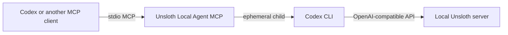

<div align="center">

# Unsloth Local Agent MCP

**Let your main coding agent delegate focused work to a local Unsloth model.**

[](https://modelcontextprotocol.io/)
[](#requirements)
[](https://www.python.org/)
[](LICENSE)

A small stdio MCP server that launches an ephemeral Codex child against your local Unsloth server. It adds an explicit model allowlist, friendly aliases, safe progress notifications, cancellation-aware cleanup, and fail-fast single-flight execution for machines that can load only one worker at a time.

</div>

> [!IMPORTANT]
> This is an unofficial community project. It is not affiliated with or endorsed by Unsloth AI or OpenAI.

## What it provides

| MCP tool | Purpose |
| --- | --- |
| `list_agent_models` | List approved local model aliases, IDs, context windows, and intended uses. |
| `spawn_local_agent` | Run one focused task, report safe activity progress, and return the final response. |



The included registry exposes two Qwen3.8 27B GGUF profiles. Edit `models.json` to match models available on your machine.

## Requirements

- Windows 10 or 11. The single-flight lock currently uses Windows `msvcrt` file locking.
- [Unsloth Desktop or CLI](https://github.com/unslothai/unsloth) with a local GGUF model available.
- [OpenAI Codex CLI](https://developers.openai.com/codex/cli/) installed and available on `PATH`.
- An MCP client. The configuration below uses Codex.

Tested with Unsloth `2026.8.22` and MCP `1.29.0` on Windows.

## Quick start

### 1. Install Unsloth and Codex

Install Unsloth from its [official download page](https://unsloth.ai/download), then install Codex CLI and confirm both commands are available. A default Unsloth Desktop installation keeps its Python environment under `%USERPROFILE%\.unsloth\studio`.

### 2. Clone this repository

```powershell
git clone https://github.com/hzhang092/unsloth-local-agent-mcp.git
Set-Location unsloth-local-agent-mcp
```

Do not install the MCP dependencies into a separate environment. Run the server with Unsloth Studio's Python so its `unsloth_cli` bridge modules and MCP package are available.

### 3. Create a persistent Unsloth-to-Codex bridge

Run Unsloth once in subagent mode with the model you want to serve:

```powershell
$unsloth = "$env:USERPROFILE\.unsloth\studio\unsloth_studio\Scripts\unsloth.exe"
& $unsloth start codex --as-subagent --persist --model "unsloth/Qwen3.8-27B-GGUF:UD-Q4_K_XL"
```

After Codex opens and Unsloth reports that the local agent is available, exit that Codex session. The `--persist` flag keeps the private bridge configuration. With the default Windows installation it is stored at:

```text
%USERPROFILE%\.unsloth\studio\auth\agents\codex-subagent\subagent.json
```

> [!WARNING]
> `subagent.json` contains a local API key. Keep it outside this repository and never commit or share it.

### 4. Review the model registry

Each alias in [`models.json`](models.json) needs three fields:

```json
{
  "id": "unsloth/Qwen3.8-27B-GGUF:UD-Q4_K_XL",
  "context_window": 152832,
  "purpose": "default coding worker"
}
```

The model ID must be available from your Unsloth server. Keep context windows realistic for your VRAM and chosen quantization.

### 5. Add the MCP server to Codex

Open `%USERPROFILE%\.codex\config.toml` and add the following block. Replace `YOUR_NAME` and the repository path with absolute paths from your machine.

```toml
[mcp_servers.unsloth_local_agent]
command = 'C:\Users\YOUR_NAME\.unsloth\studio\unsloth_studio\Scripts\python.exe'
args = [
  'C:\path\to\unsloth-local-agent-mcp\server.py',
  'C:\Users\YOUR_NAME\.unsloth\studio\auth\agents\codex-subagent\subagent.json',
]
required = true
enabled_tools = ["spawn_local_agent", "list_agent_models"]
default_tools_approval_mode = "approve"
startup_timeout_sec = 15
tool_timeout_sec = 3600
```

Restart Codex after saving the file.

### 6. Verify the server

```powershell
$python = "$env:USERPROFILE\.unsloth\studio\unsloth_studio\Scripts\python.exe"
& $python .\server.py --check
```

You should see the default alias and every configured model. In Codex, call `list_agent_models`, then ask it to use `spawn_local_agent` for a focused task.

## Using another MCP client

This is a standard stdio server. Configure your client with the same command and two arguments shown above: Unsloth Studio's `python.exe`, this repository's `server.py`, and the private `subagent.json` path. Set the client tool timeout close to one hour for long local generations.

## Safety and behavior

- Only aliases declared in `models.json` can run.
- Only one local child can run at a time. An overlapping request returns a clear busy error immediately instead of waiting invisibly.
- Child Codex sessions are ephemeral and do not reuse chat history.
- Progress reports contain event counts only; child output is not copied into progress messages.
- Cancelling an MCP call stops the full child process tree and releases the concurrency lock.
- The default bridge uses `workspace-write` with approvals disabled. If the bridge config was generated with Unsloth's `--yolo` flag, the child instead bypasses sandbox and approvals. Use that mode only when you understand the risk.
- The child stops after 900 seconds without output or 3,500 seconds total; configure the MCP client timeout to at least 3,600 seconds.

## Troubleshooting

**`ModuleNotFoundError: unsloth_cli`**  
The MCP is using the wrong Python interpreter. Point `command` to Unsloth Studio's `python.exe`.

**`codex is not installed or is not on PATH`**  
Install Codex CLI, restart your terminal or MCP client, and confirm `Get-Command codex` succeeds.

**`Configured model unavailable`**  
Check that the exact model ID and quantization in `models.json` are available to the running Unsloth server.

**The MCP client times out**  
Increase its tool timeout to 3,600 seconds or more. Local inference can take several minutes.

**`Local Qwen agent is busy`**

Another local child is active. Retry after that call finishes.

## Development

Run the focused regression tests with Unsloth Studio's Python:

```powershell
$python = "$env:USERPROFILE\.unsloth\studio\unsloth_studio\Scripts\python.exe"
& $python -m unittest -v test_server.py
```

The tests cover async tool registration, fail-fast concurrency, cancellation cleanup, safe progress reporting, and Windows child-process termination.

## Compatibility

This bridge integrates with internal `unsloth_cli` modules and may need updates when Unsloth changes those APIs. The tested Unsloth version is listed above so breakage is easy to diagnose.

## License

Licensed under [AGPL-3.0-only](LICENSE). The bridge is derived from AGPL-licensed Unsloth CLI code; upstream copyright notices are retained in `server.py`.
