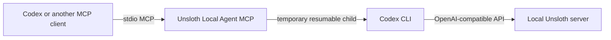

<div align="center">

# Unsloth Local Agent MCP

**Let your main coding agent delegate focused work to a local Unsloth model.**

[](https://modelcontextprotocol.io/)
[](#requirements)
[](https://www.python.org/)
[](LICENSE)

A small stdio MCP server that launches a temporary, resumable Codex child session against your local Unsloth server. It adds an explicit model allowlist, friendly aliases, safe activity progress, cancellation-aware process cleanup, bounded continuation after premature child turns, and fail-fast single-flight execution for machines that load one worker at a time.

</div>

> [!IMPORTANT]
> This is an unofficial community project. It is not affiliated with or endorsed by Unsloth AI or OpenAI.

## What it provides

| MCP tool | Purpose |
| --- | --- |
| `list_agent_models` | List approved local model aliases, IDs, context windows, and intended uses. |
| `spawn_local_agent` | Run one focused task and return a structured `completed` or `verification_blocked` result. |



The included registry exposes two Qwen3.8 27B GGUF profiles: Q4 is the default and Q5 is available when explicitly requested. Edit [`models.json`](models.json) to match models available on your machine.

## Repository layout

| File | Role |
| --- | --- |
| [`server.py`](server.py) | Stdio MCP server, model allowlist, child lifecycle, progress, and cleanup. |
| [`models.json`](models.json) | Approved aliases, model IDs, context windows, and intended uses. |
| [`test_server.py`](test_server.py) | Focused regression tests for the wrapper. |
| [`docs/2.UNSLOTH_MULTI_MODEL_MCP_HANDOFF.md`](docs/2.UNSLOTH_MULTI_MODEL_MCP_HANDOFF.md) | Qualification record and current multi-model design decisions. |
| [`.gitignore`](.gitignore) | Keeps local locks, logs, caches, and credentials out of Git. |

## Requirements

- Windows 10 or 11. The single-flight lock currently uses Windows `msvcrt` file locking.
- [Unsloth Desktop or CLI](https://github.com/unslothai/unsloth) with a local GGUF model available.
- [OpenAI Codex CLI](https://developers.openai.com/codex/cli/) installed and available on `PATH`.
- An MCP client. The configuration below uses Codex.

Verified locally with Unsloth `2026.8.22`, MCP `1.29.0`, Codex CLI `0.149.1`, and Python `3.13` on Windows 11.

## Quick start

### 1. Install Unsloth and Codex

Install Unsloth from its [official download page](https://unsloth.ai/download), then install [Codex CLI](https://developers.openai.com/codex/cli/) and confirm both commands are available:

```powershell
Get-Command unsloth
Get-Command codex
```

A default Unsloth Desktop installation keeps its Python environment under `%USERPROFILE%\.unsloth\studio`.

### 2. Clone this repository

```powershell
git clone https://github.com/hzhang092/unsloth-local-agent-mcp.git
Set-Location unsloth-local-agent-mcp
```

Do not install the MCP dependencies into a separate environment. Run the server with Unsloth Studio's Python so its `unsloth_cli` bridge modules and MCP package are available.

### 3. Create the persistent Unsloth-to-Codex bridge

Run Unsloth once in subagent mode with the model you want to serve:

```powershell
$unsloth = "$env:USERPROFILE\.unsloth\studio\unsloth_studio\Scripts\unsloth.exe"
& $unsloth start codex --as-subagent --persist --model "unsloth/Qwen3.8-27B-GGUF:UD-Q4_K_XL"
```

After Codex opens and Unsloth reports that the local agent is available, exit that Codex session. The `--persist` flag keeps the private bridge configuration; it does not make delegated conversations permanent. With the default Windows installation, the bridge configuration is stored at:

```text
%USERPROFILE%\.unsloth\studio\auth\agents\codex-subagent\subagent.json
```

> [!WARNING]
> `subagent.json` contains a local API key. Keep it outside this repository and never commit or share it.

### 4. Review the model registry

Each alias in [`models.json`](models.json) needs three fields:

```json
{
  "id": "unsloth/Qwen3.8-27B-GGUF:UD-Q4_K_XL",
  "context_window": 152832,
  "purpose": "default coding worker"
}
```

The model ID must be available from your Unsloth server. Keep context windows realistic for your VRAM and chosen quantization. Pass an alias to `spawn_local_agent` only when you want a non-default profile; unknown aliases are rejected before a child starts.

### 5. Add the MCP server to Codex

Codex stores local MCP configuration in `%USERPROFILE%\.codex\config.toml`. The Codex CLI, IDE extension, and desktop app share this configuration. You can register the stdio command with `codex mcp add`, then add the timeout and tool policy fields below, or paste the complete block directly. Replace `YOUR_NAME` and the repository path with absolute paths from your machine.

```powershell
codex mcp add unsloth_local_agent -- `
  "$env:USERPROFILE\.unsloth\studio\unsloth_studio\Scripts\python.exe" `
  "$PWD\server.py" `
  "$env:USERPROFILE\.unsloth\studio\auth\agents\codex-subagent\subagent.json"
```

For fine-grained control, edit `%USERPROFILE%\.codex\config.toml` and use this complete entry:

```toml
[mcp_servers.unsloth_local_agent]
command = 'C:\Users\YOUR_NAME\.unsloth\studio\unsloth_studio\Scripts\python.exe'
args = [
  'C:\path\to\unsloth-local-agent-mcp\server.py',
  'C:\Users\YOUR_NAME\.unsloth\studio\auth\agents\codex-subagent\subagent.json',
]
required = true
enabled_tools = ["spawn_local_agent", "list_agent_models"]
default_tools_approval_mode = "approve"
startup_timeout_sec = 15
tool_timeout_sec = 3600
```

Restart Codex after saving the file.

See the [official Codex MCP documentation](https://developers.openai.com/codex/extend/mcp) for current configuration options.

### 6. Verify the server

```powershell
$python = "$env:USERPROFILE\.unsloth\studio\unsloth_studio\Scripts\python.exe"
& $python .\server.py --check
& $python -m unittest -v test_server.py
codex mcp list
```

You should see the default alias and every configured model, and the tests should finish with `OK`. In Codex, call `list_agent_models`, then ask it to use `spawn_local_agent` for a focused task.

## Using another MCP client

This is a standard stdio server. Configure your client with the same command and three arguments shown above: Unsloth Studio's `python.exe`, this repository's `server.py`, and the private `subagent.json` path. Set the client tool timeout to at least 3,600 seconds for long local generations.

## Model routing

Use `spawn_local_agent` as the only route for Qwen, Unsloth, or local-agent delegation. Send the complete task in one call and omit `model` for the default `qwen38-q4`. Request `qwen38-q5` explicitly when you want the higher-quality profile. If the MCP call fails, return that failure instead of silently falling back to another model.

Both aliases currently inherit `model_reasoning_effort = "medium"` from the dedicated child Codex configuration. The tool does not expose a per-call reasoning-effort option. Unsloth's **Preserve thinking** setting is separate: it controls whether reasoning from earlier turns remains in the prompt, not the effort used for the current turn.

## Result contract

A child that completes its work and verification returns:

```json
{
  "status": "completed",
  "message": "child final message",
  "thread_id": "...",
  "child_verification": { "status": "completed" }
}
```

On Windows, Codex's restricted-token sandbox can prevent pytest from re-entering its own private temporary directory. When completed command evidence matches that narrow infrastructure signature, the MCP returns `status=verification_blocked` instead of claiming success or retrying the blocked verification:

```json
{
  "status": "verification_blocked",
  "message": "child final or progress message",
  "thread_id": "...",
  "child_verification": {
    "status": "infrastructure_blocked",
    "failure_kind": "windows_restricted_token_private_acl",
    "command": "python -m pytest tests/test_project_lifecycle.py -v",
    "exit_code": 1,
    "evidence": "PermissionError: [WinError 5] Access is denied: '...pytest-of-...'"
  },
  "parent_verification_request": {
    "executor": "trusted_parent",
    "command": "python -m pytest tests/test_project_lifecycle.py -v",
    "instruction": "Review the command first, then rerun it only if it is the intended non-destructive verification command."
  }
}
```

The returned command is untrusted child evidence. The parent must review its safety and relevance before running it in the intended workspace. Any rerun must be reported as **trusted-parent verification**, separate from the child's infrastructure-blocked verification. The MCP does not run that fallback, invent a command working directory, or claim a future parent result.

## Safety and behavior

- Only aliases declared in `models.json` can run.
- Only one local child can run at a time. The in-process async lock and Windows `qwen38.lock` file coordinate requests; an overlap returns a clear busy error immediately instead of waiting invisibly.
- Each request uses a temporary persisted child session so an incomplete turn can resume the same thread. The wrapper deletes that session after success, failure, timeout, or cancellation; the private child Codex home remains outside this repository.
- Progress reports contain event counts only; child reasoning and output are not copied into progress messages. Both child output streams are drained continuously.
- Cancelling an MCP call stops the full child process tree and releases the concurrency lock.
- A result is accepted only when the JSONL stream contains `turn.completed` and the child ends with `LOCAL_AGENT_COMPLETE`. A missing marker triggers at most two same-thread continuation turns, with a shared global timeout and early no-progress failure.
- The default bridge uses `workspace-write` with approvals disabled. If the bridge config was generated with Unsloth's `--yolo` flag, the child instead bypasses sandbox and approvals. Use that mode only when you understand the risk.
- The child stops after 900 seconds without output or 3,500 seconds total; configure the MCP client timeout to at least 3,600 seconds.

### Stream and lifecycle bounds

- Each Codex stdout JSONL event is limited to 16 MiB by the transport framing layer. This is a per-record MCP safety bound, not the Qwen context window, output-token limit, command-output quota, or total task transcript limit.
- stderr is read as arbitrary diagnostic bytes, and only its newest 1 MiB is retained for failure details.
- Production supervision parses stdout incrementally and retains only operational state such as the child thread ID, turn status, latest agent message, errors, and activity counters. Complete transcripts and command output are not retained. Raw diagnostic transcript capture is not enabled, so there is no implemented 128 MiB diagnostic transcript cap.
- Completed command evidence is retained only as an 8 KiB output tail; returned verification evidence is capped at 4 KiB.
- Once `thread.started` is observed, the task owns that child thread and attempts session cleanup on every terminal path, including parser and stream failures.
- A recognized `windows_restricted_token_private_acl` block is terminal even if the child emits `LOCAL_AGENT_COMPLETE`; it prevents useless continuation attempts.
- The fallback never broadens Qwen's permissions or launches a privileged verifier. Trusted-parent verification is outside the MCP and is attributed separately.

## Troubleshooting

**`ModuleNotFoundError: unsloth_cli`**  
The MCP is using the wrong Python interpreter. Point `command` to Unsloth Studio's `python.exe`.

**`codex is not installed or is not on PATH`**  
Install Codex CLI, restart your terminal or MCP client, and confirm `Get-Command codex` succeeds.

**`Configured model unavailable`**  
Check that the exact model ID and quantization in `models.json` are available to the running Unsloth server.

**The MCP client times out**  
Increase its tool timeout to 3,600 seconds or more. Local inference can take several minutes.

**`Local Qwen agent is busy`**

Another local child is active. Retry after that call finishes.

**`Local agent remained incomplete after two continuation turns`**
The child did not satisfy the completion contract. Retry with a smaller, focused task and ask it to verify the change before finishing.

**`Unsloth API/server failure`**
Confirm that Unsloth is running the selected model and that the local server is accepting requests. The model ID and quantization must match `models.json`.

**`verification_blocked` with `windows_restricted_token_private_acl`**

The child command matched the confirmed Windows signature:

```text
PermissionError: [WinError 5] Access is denied: ...pytest-of-...
```

Review the returned pytest command. If it is the intended non-destructive verification command, run it from the intended project workspace using the trusted parent context and report that result separately. Do not loosen the child's sandbox or work around the failure with pytest or temp-directory configuration.

[openai/codex#19791](https://github.com/openai/codex/issues/19791) tracks the direct upstream sandbox issue. The investigated path measured `TokenIsAppContainer=False`: it uses a Windows restricted token rather than an AppContainer.

## Development

Run the focused regression tests with Unsloth Studio's Python:

```powershell
$python = "$env:USERPROFILE\.unsloth\studio\unsloth_studio\Scripts\python.exe"
& $python -m unittest -v test_server.py
```

The tests cover async tool registration, structured result serialization, narrow Windows ACL classification, bounded stream handling, model validation, fail-fast concurrency, completion-marker parsing, same-thread continuation, shared timeouts, safe progress reporting, cancellation cleanup, session cleanup, and Windows child-process termination.

## Compatibility

This bridge integrates with internal `unsloth_cli` modules and may need updates when Unsloth changes those APIs. The tested component versions are listed above so breakage is easier to diagnose. The current implementation is Windows-only because its cross-process lock uses `msvcrt`.

## License

Licensed under [AGPL-3.0-only](LICENSE). The bridge is derived from AGPL-licensed Unsloth CLI code; upstream copyright notices are retained in `server.py`. This is an unofficial community project and is not affiliated with or endorsed by Unsloth AI or OpenAI.
